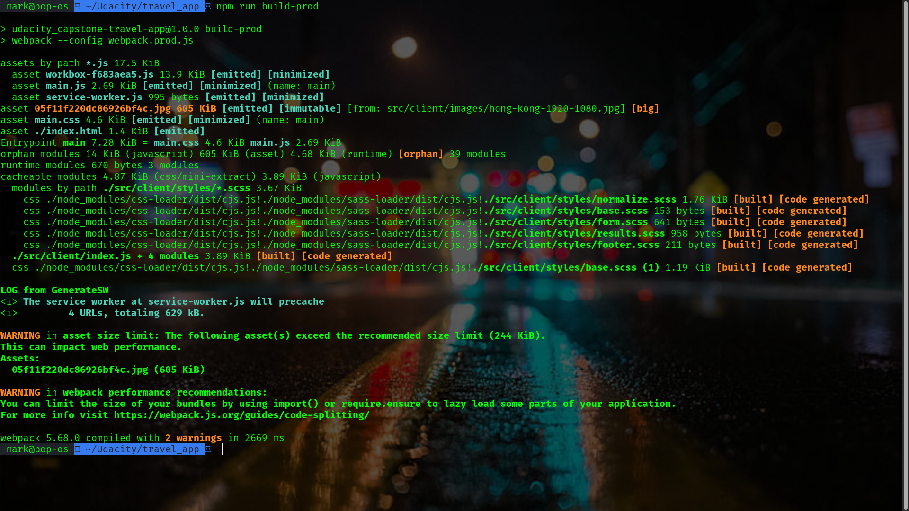

# Travel App

This is the final "capstone" project of the Front End Web Developer "Nano-Degree" program.

This is a simple form where you can enter the location of your trip, and also the
start and end dates as well. Once you click on "Submit", this makes an API request
to Geonames' API which provides the location's exact coordinates. These "coordinates"
are used to in conjunction with weatherbit.io's API to provide current weather information for said location.

All images are provided by pixabay.com's API.

## API's
* [Geonames](http://www.geonames.org/) 
* [Weatherbit](https://www.weatherbit.io/)
* [Pixabay](https://pixabay.com/)

Please create an account with all the API's mentioned above by clicking on each
individual link. Once registered, you should then have three API keys.

## Create a .env file in the root path

Geonames will allow you to use your "username" that you have created as an API key
in your .env file, however, weatherbit.io and also pixabay.com will provide you
with API keys once you register

```.env
GEO_KEY=geonames_username
W_BIT_KEY=xxxxxxxxxxxxxxxxxxxxxxxxxxxxxxxx
P_IMAGES_KEY=xxxxxxxxxxxxxxxxxxxxxxxxxxxxxxxxxx
```

## Install dependencies

Once you have created your .env file in the root path, you can install all
the npm packages by running this command in the terminal : 

```bash
npm i
```


Make sure to also create the "dist" folder by running this command in the terminal : 

```bash
npm run build-prod
```



If all is successful without any error messages, start the app by running this command in the terminal : 

```bash
npm run start
```


The app will start running on "http://localhost:8081"

## Running tests with jest

Please make sure to run ```npm run build-prod``` prior to attempting to run the ```npm run test``` command.

>***server.spec.js*** will NOT pass unless you build the ***dist*** folder first.

